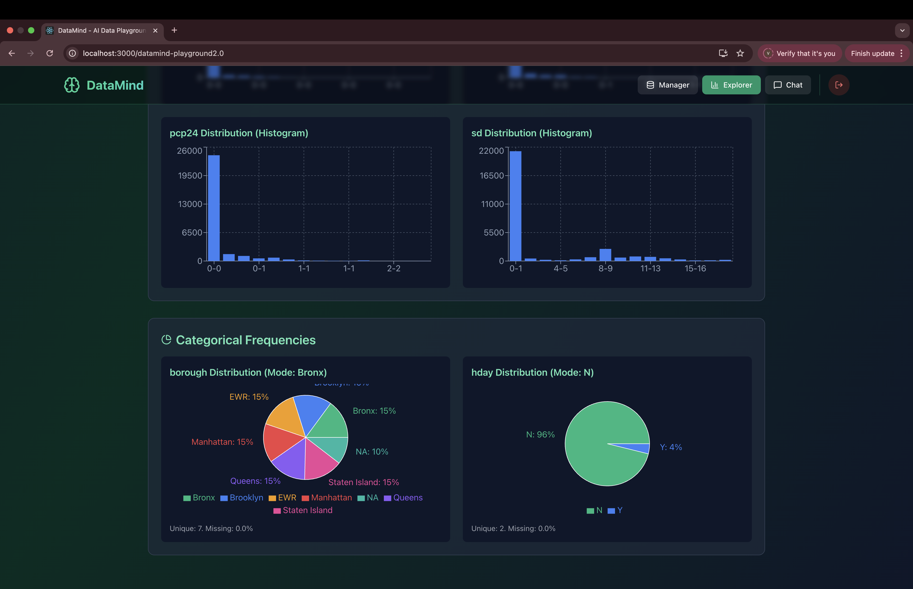
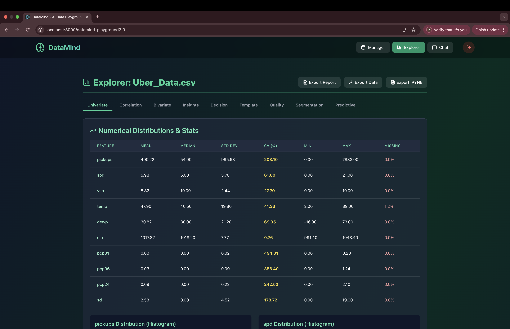
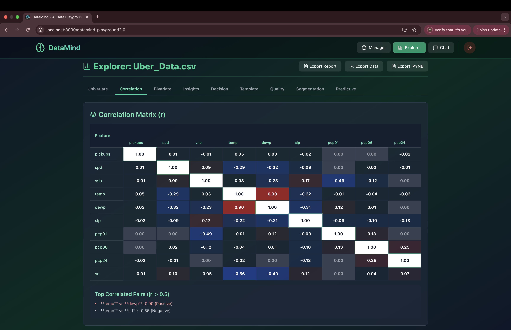
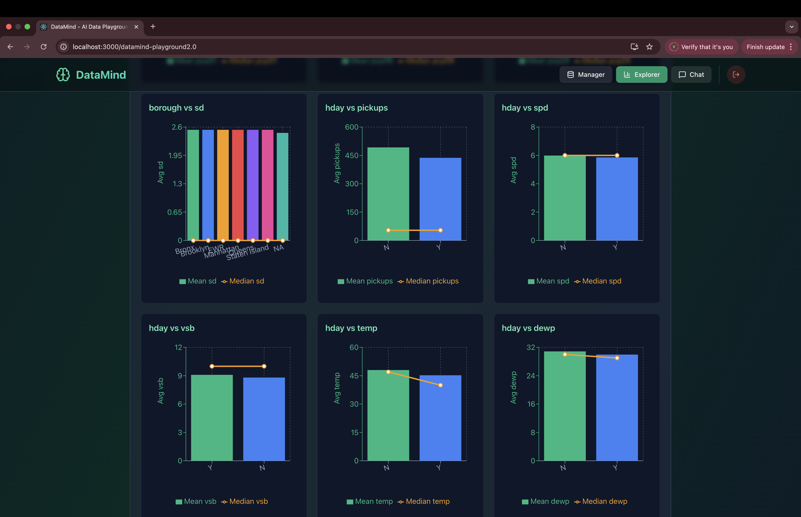
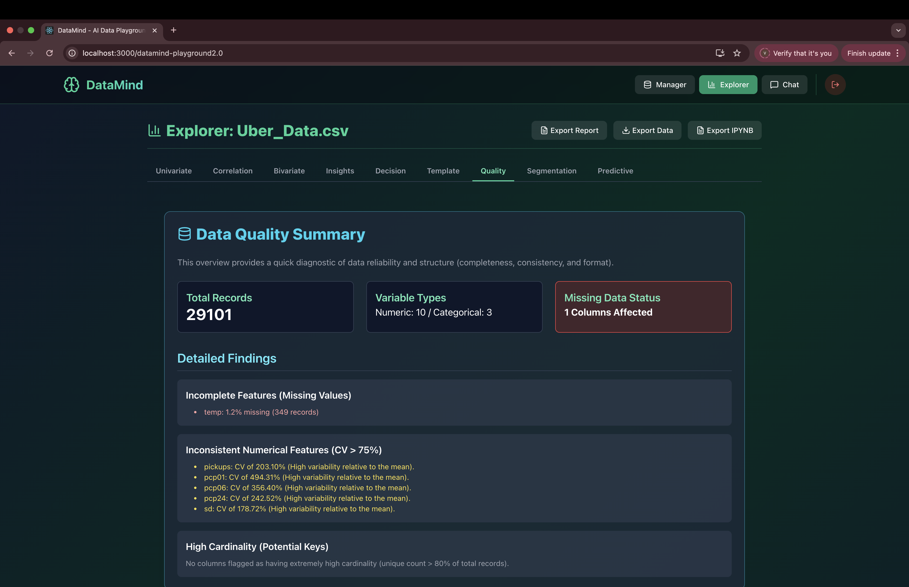
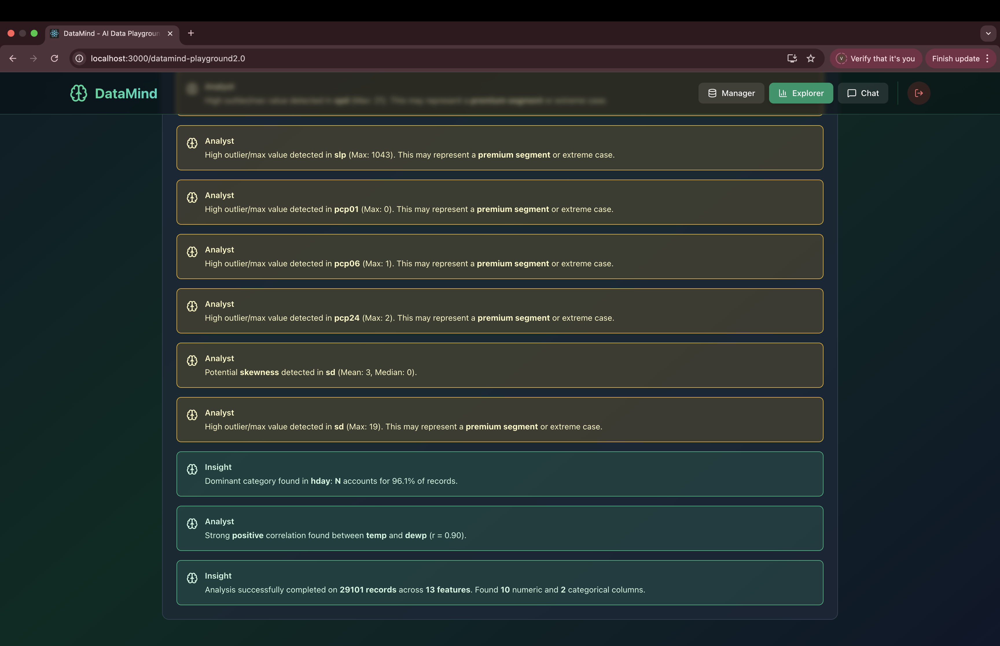
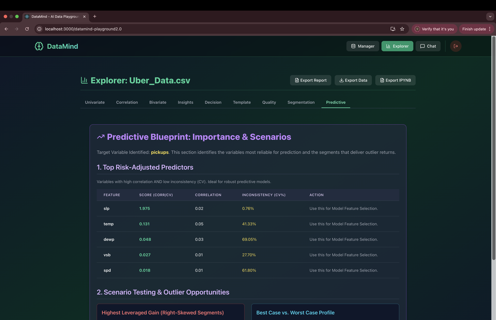
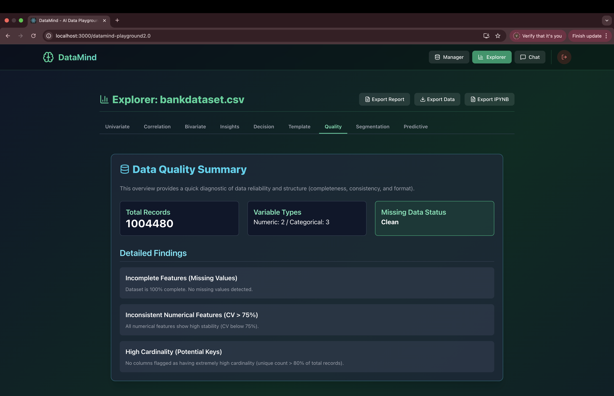

# DataMind — AI Data Playground

DataMind is a browser-based Exploratory Data Analysis (EDA) tool built with React that allows users to upload CSV datasets and instantly generate statistical insights, visualizations, and analytical summaries — without any backend server.

The entire analysis pipeline runs locally in the user’s browser, making it fast, private, and easy to deploy.
Upload CSV → Instantly generate statistical insights, visualizations, and predictive signals — directly in your browser.
⸻

## Live Demo
https://joelraj18.github.io/datamind-playground2.0/

## Screenshots

### Univariate Analysis

### Statistical Summary

### Correlation Matrix

### Bivariate Analysis

### Insights Engine

### Advanced Insights

### Decision / Predictive Blueprint

### Large Dataset Handling

Core Features

DataMind automatically performs multiple layers of analysis after a CSV upload.

1. Univariate Analysis
	•	Mean
	•	Median
	•	Standard Deviation
	•	Coefficient of Variation (CV)
	•	Min / Max
	•	Missing value detection
	•	Distribution histograms

2. Correlation Analysis
	•	Correlation matrix
	•	Detection of strong relationships
	•	Top correlated feature pairs

3. Bivariate Analysis
	•	Category vs numeric comparisons
	•	Mean and median comparisons
	•	Aggregated visualizations

4. Insights Engine

Automatically generates insights such as:
	•	Dataset overview
	•	Variable distribution observations
	•	Potential anomalies
	•	Feature relationships

5. Decision Center

Executive-level summary highlighting:
	•	Key risks
	•	Opportunities
	•	Stability indicators

6. Predictive Blueprint

Identifies variables with:
	•	Predictive potential
	•	High signal-to-noise ratios
	•	Low inconsistency

7. Customer Segmentation Blueprint

Builds example segmentation insights from categorical and numeric relationships.

8. Data Quality Analysis

Checks for:
	•	Missing data
	•	High cardinality columns
	•	Feature inconsistencies

9. Jupyter Notebook Template Export

Allows users to export a starter notebook for further Python-based analysis.

⸻

Tech Stack

Frontend
	•	React
	•	Tailwind CSS
	•	Recharts

Data Processing
	•	PapaParse (CSV parsing)
	•	JavaScript statistical functions

Visualization
	•	Recharts

Deployment Options
	•	Vercel
	•	GitHub Pages
	•	Netlify
	•	Any static hosting

⸻

Architecture

Current data pipeline:

CSV Upload
↓
PapaParse (Web Worker Parsing)
↓
Dataset stored in React state
↓
EDA computed in analyzeDataset()
↓
Charts rendered with Recharts

⸻

Performance Optimizations

Large datasets can overwhelm browsers, so the system uses sampling during analysis.

Example:

const MAX_ANALYSIS_ROWS = 110000;

const data = dataset.data.length > MAX_ANALYSIS_ROWS
    ? dataset.data.slice(0, MAX_ANALYSIS_ROWS)
    : dataset.data;

This allows the app to handle large datasets (~1M rows) without crashing.

⸻

Current Capabilities

Tested with datasets up to:

• ~1,000,000 rows
• Multiple numerical and categorical columns
• Client-side analysis completed successfully

The system performs all analytics without requiring a backend.

⸻

Future Architecture Improvements

The current version stores the entire dataset in React memory, which is not optimal for extremely large datasets.

Future architecture will separate storage and analysis.

Planned Architecture

Raw Data → IndexedDB
Sample Data → React Memory
Analytics → Computed on Sample

Pipeline:

CSV Upload
↓
PapaParse Streaming
↓
Store raw rows in IndexedDB
↓
Extract sample for analytics
↓
Store sample in React state
↓
Run analysis on sample

Benefits:

• Supports 10M+ rows
• Prevents browser memory crashes
• Enables progressive analysis
• Enables lazy loading of data

⸻

Additional Future Improvements

1. Streaming CSV Processing

Instead of loading all rows into memory:

CSV → Stream chunks → Store in IndexedDB

Benefits:

• Unlimited CSV size
• Lower memory usage
• Faster UI responsiveness

⸻

2. Visualization Downsampling

Large datasets overwhelm chart libraries.

Future improvement:

Charts will render sampled points rather than full datasets.

Example strategy:
	•	Largest Triangle Three Buckets (LTTB)
	•	Random sampling
	•	Aggregation bins

Benefits:

• Smooth charts
• Fast rendering
• Support millions of records

⸻

3. WASM Data Engine (Optional)

Integrate DuckDB WASM for advanced analytics.

Capabilities:
	•	SQL queries on CSV
	•	Large dataset processing
	•	Faster aggregations
	•	Complex joins

Architecture:

CSV → DuckDB WASM → Results → React

⸻

4. AI Insight Engine

Future versions may generate:
	•	Automated explanations
	•	Suggested hypotheses
	•	Feature importance summaries

Possible stack:
	•	LLM APIs
	•	Local models
	•	Prompt-based analysis summaries

⸻

5. ML Model Suggestions

Automatically recommend models based on dataset structure:

Examples:
	•	Regression
	•	Classification
	•	Clustering

⸻

6. Feature Engineering Suggestions

Possible automatic detection:
	•	Skewed variables
	•	Outliers
	•	Log transformations
	•	Feature scaling

⸻

Development Notes

If performance issues occur:

Check:
	1.	Dataset size
	2.	Number of columns
	3.	Sampling threshold
	4.	Chart rendering load

Important functions:

handleFileUpload()
CSV parsing logic

analyzeDataset()
EDA computation pipeline

⸻

Future Improvement Prompt (for ChatGPT)

If continuing development with ChatGPT, use the following prompt:

“I built a React-based browser data analysis tool called DataMind.
It uses PapaParse for CSV parsing and performs EDA directly in the browser.
The system currently samples data for analysis to prevent crashes.
The long-term architecture plan is:

Raw Data → IndexedDB
Sample → React Memory

Act as a senior data platform engineer and recommend the next most impactful improvement while keeping the system browser-based.”

This project was bootstrapped with [Create React App](https://github.com/facebook/create-react-app).

## Available Scripts

In the project directory, you can run:

### `npm start`

Runs the app in the development mode.\
Open [http://localhost:3000](http://localhost:3000) to view it in your browser.

The page will reload when you make changes.\
You may also see any lint errors in the console.

### `npm test`

Launches the test runner in the interactive watch mode.\
See the section about [running tests](https://facebook.github.io/create-react-app/docs/running-tests) for more information.

### `npm run build`

Builds the app for production to the `build` folder.\
It correctly bundles React in production mode and optimizes the build for the best performance.

The build is minified and the filenames include the hashes.\
Your app is ready to be deployed!

See the section about [deployment](https://facebook.github.io/create-react-app/docs/deployment) for more information.

### `npm run eject`

**Note: this is a one-way operation. Once you `eject`, you can't go back!**

If you aren't satisfied with the build tool and configuration choices, you can `eject` at any time. This command will remove the single build dependency from your project.

Instead, it will copy all the configuration files and the transitive dependencies (webpack, Babel, ESLint, etc) right into your project so you have full control over them. All of the commands except `eject` will still work, but they will point to the copied scripts so you can tweak them. At this point you're on your own.

You don't have to ever use `eject`. The curated feature set is suitable for small and middle deployments, and you shouldn't feel obligated to use this feature. However we understand that this tool wouldn't be useful if you couldn't customize it when you are ready for it.

## Learn More

You can learn more in the [Create React App documentation](https://facebook.github.io/create-react-app/docs/getting-started).

To learn React, check out the [React documentation](https://reactjs.org/).

### Code Splitting

This section has moved here: [https://facebook.github.io/create-react-app/docs/code-splitting](https://facebook.github.io/create-react-app/docs/code-splitting)

### Analyzing the Bundle Size

This section has moved here: [https://facebook.github.io/create-react-app/docs/analyzing-the-bundle-size](https://facebook.github.io/create-react-app/docs/analyzing-the-bundle-size)

### Making a Progressive Web App

This section has moved here: [https://facebook.github.io/create-react-app/docs/making-a-progressive-web-app](https://facebook.github.io/create-react-app/docs/making-a-progressive-web-app)

### Advanced Configuration

This section has moved here: [https://facebook.github.io/create-react-app/docs/advanced-configuration](https://facebook.github.io/create-react-app/docs/advanced-configuration)

### Deployment

This section has moved here: [https://facebook.github.io/create-react-app/docs/deployment](https://facebook.github.io/create-react-app/docs/deployment)

### `npm run build` fails to minify

This section has moved here: [https://facebook.github.io/create-react-app/docs/troubleshooting#npm-run-build-fails-to-minify](https://facebook.github.io/create-react-app/docs/troubleshooting#npm-run-build-fails-to-minify)
